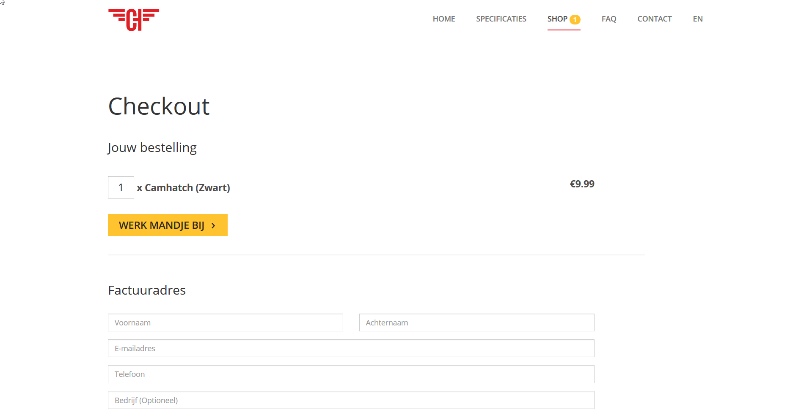
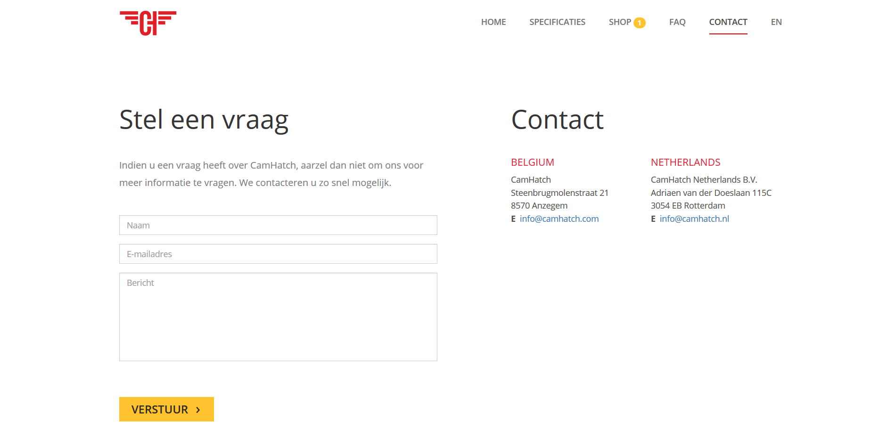
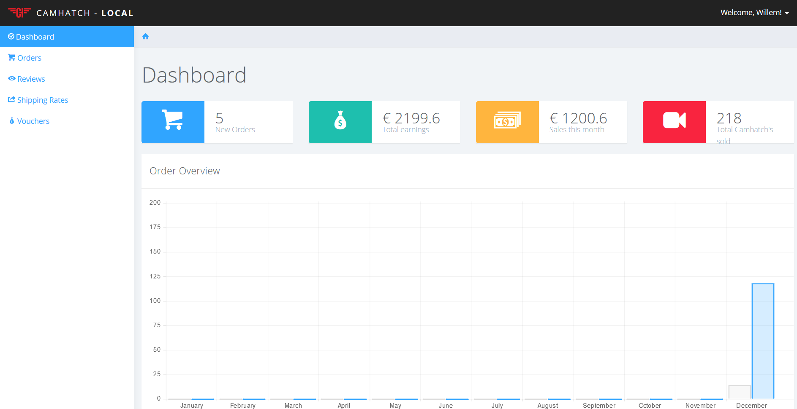
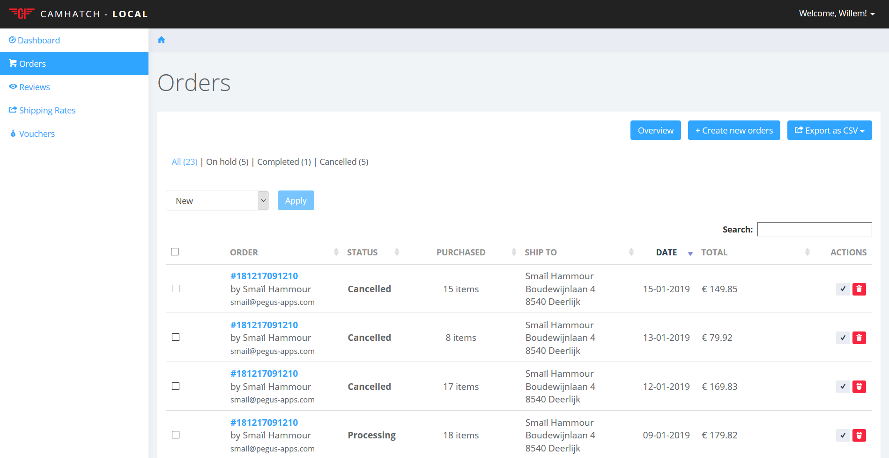
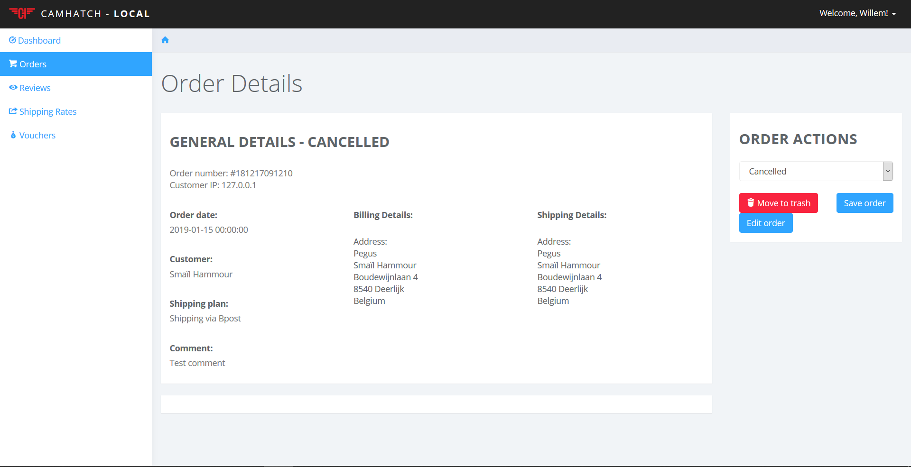
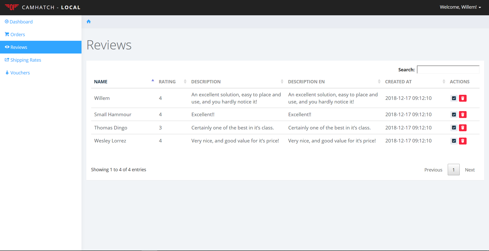
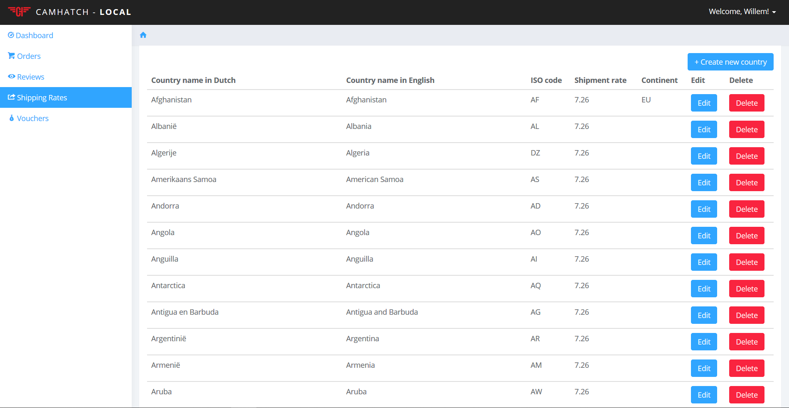
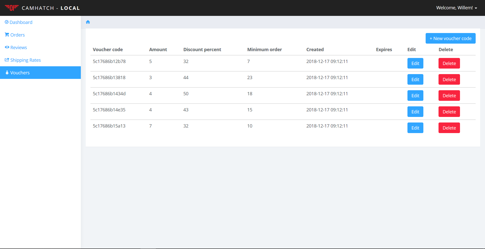

# Project introduction
 
 This is project CamHatch. The application is about selling CamHatches to costumers. There are no users only admins. If you want to know which blade uses which controller you type this in you prompt `php artisan route:list`. Don't forget that if you want to work on localhost you must run `php artisan serve`. 
 
## Home 

This is the home screen there is nothing important to say about this. The navigation bar is the only item of value.

### Shop

This is the shop page it contains many important function like.

+ calculatePrice
+ calculateVoucher
+ getCheckout 

### FAQ

This is the FAQ(Frequently Asked Questions) page there is nothing important to say about this.

### Contact

This is the contact page there is nothing important to say about this.

### EN

The EN NL button is in de nav bar it changes the language.

# Admin 

Now let's talk about the admin side of CamHatch which has much more functions and things I can explain.

### Admin Home 

This is the admin home page it shows some nice information to the admin with a chart.

### Admin order 

In the order page you can make, change, delete and show an order.

 
 If you click on a order you will go to order detail and see all the details of an order.

### Reviews 
This is the reviews page

In the reviews page you can delete or deactivate a review. It's not an exciting page.

### Shipping 

You can edit, delete and create a country. It will automatically show all the countries but you can search specific ones as well. If you make a country there wil be required fields and rules to those fields.

### Vouchers 

You can edit delete and create a voucher. There are rules tho you must have an amount bigger then 1, a minimum order bigger then 1, a percentage between 1 and 100 and a the expires date must be today or any day after that. 

